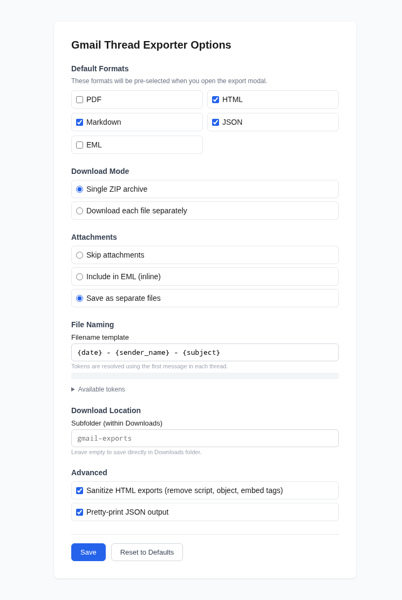

<p align="center">
  
</p>

# Gmail Thread Exporter

<!-- BADGES:START -->

[](https://github.com/geoffmyers/gmail-thread-exporter/releases/latest)
[](LICENSE.md)
[](CONTRIBUTING.md)
<!-- BADGES:END -->

## Table of Contents

- [Description](#description)
- [Screenshots](#screenshots)
- [Features](#features)
- [Requirements](#requirements)
- [Installation](#installation)
  - [1. Clone the repository](#1-clone-the-repository)
  - [2. Create a Google Cloud OAuth client](#2-create-a-google-cloud-oauth-client)
  - [3. Load the extension](#3-load-the-extension)
- [Usage](#usage)
  - [Export formats](#export-formats)
  - [Output layout](#output-layout)
- [Configuration](#configuration)
  - [Filename template tokens](#filename-template-tokens)
- [Permissions](#permissions)
- [Architecture](#architecture)
- [Credits](#credits)
- [Contributing](#contributing)
- [License](#license)

## Description

A Manifest V3 Chrome extension that adds an **Export** button to Gmail's
toolbar. Tick some threads, click it, and the extension downloads them as PDF,
HTML, Markdown, JSON or EML, packed into a single ZIP or saved as separate
files, with their attachments if you want them.

It reads your mail through the Gmail API with a read-only scope, using an
OAuth client you create in your own Google Cloud project. Nothing passes
through a third-party server.

> **This extension is not on the Chrome Web Store.** You load it unpacked (or
> from a [Releases](https://github.com/geoffmyers/gmail-thread-exporter/releases/latest)
> zip) from `chrome://extensions`. `manifest.json` commits a `key`, which
> pins the extension's ID — and therefore its OAuth redirect URL — to the same
> value on every machine that loads it unpacked. The committed
> `oauth2.client_id` is the author's own Google Cloud OAuth client, scoped to
> that one pinned ID; it will not authorise anyone else's Google account. To
> use your own OAuth client, follow [step 2](#2-create-a-google-cloud-oauth-client)
> below: replace `oauth2.client_id` with your own, or remove `key` entirely
> and use the extension ID Chrome then assigns instead.

## Screenshots

<p align="center">
  
</p>

<p align="center"><em>The options page: default formats, ZIP or separate files, attachment handling and the filename template.</em></p>

## Features

- **Bulk export** from any thread list: Inbox, Sent, a label or search results
- **Five formats**: PDF, HTML, Markdown, JSON and EML
- **Whole conversations**: HTML, PDF and Markdown render each thread as one
  document
- **ZIP or separate downloads**
- **Attachments** skipped, embedded in the EML files, or saved alongside
- **Filenames from a template** with 11 tokens for dates, senders, recipients,
  subject and thread ID
- **HTML sanitising** that strips scripts, embeds, iframes, inline event
  handlers and `javascript:`/`vbscript:`/`data:text/html` links from exported
  message bodies
- **A confirmation before large exports** (50+ threads), since fetching,
  rendering and zipping that many can take several minutes and real memory
- **Progress tracking** with threads done, threads remaining and a time
  estimate
- **Read-only access**: the only Gmail scope requested is
  `gmail.readonly`

## Requirements

- **Google Chrome 109** or newer, or another Chromium-based browser with
  Manifest V3 support (Edge, Brave, Arc)
- **Developer mode** turned on at `chrome://extensions`, to load the extension
  unpacked
- A **Google account** with Gmail
- A **Google Cloud project** of your own, with the Gmail API enabled and an OAuth
  client. It is free, and the steps are below.
- **Node.js 20+** and npm, only to update the bundled libraries or run the
  tests. The built libraries are already in `vendor/`.

## Installation

A ready-to-load build of each version is on the
[Releases](https://github.com/geoffmyers/gmail-thread-exporter/releases/latest)
page: unzip it and load that folder in step 3 instead of a clone. You still need
the OAuth client from step 2, with its client ID in the unzipped
`manifest.json`.

### 1. Clone the repository

```bash
git clone https://github.com/geoffmyers/gmail-thread-exporter.git
cd gmail-thread-exporter
```

### 2. Create a Google Cloud OAuth client

The extension signs in with `chrome.identity.launchWebAuthFlow`, which needs a
**Web application** OAuth client, not a "Chrome extension" one. Google sends
the token back to the extension's redirect URL:

```
https://feedjkeeglhgiabchofebodhfkfbpegl.chromiumapp.org/
```

That ID is fixed by the `key` in `manifest.json`, so it is the same on every
machine. If you remove the key, Chrome assigns a new ID, and you should use the
one shown on the extension's card instead.

1. In the [Google Cloud Console](https://console.cloud.google.com), create a
   project.
2. Under **APIs & Services → Library**, enable the **Gmail API**.
3. Under **APIs & Services → OAuth consent screen**:
   - choose **External**,
   - add the scope `https://www.googleapis.com/auth/gmail.readonly`,
   - add your own Google account as a **test user**.
4. Under **APIs & Services → Credentials**, choose **Create credentials → OAuth
   client ID**:
   - Application type: **Web application**
   - Authorized redirect URIs: the `chromiumapp.org` URL above, including the
     trailing slash
5. Copy the **Client ID** into `manifest.json`, replacing the value of
   `oauth2.client_id`. The one committed here belongs to the author's project
   and will not authorise your account.

### 3. Load the extension

1. Open `chrome://extensions`.
2. Turn on **Developer mode** (top right).
3. Click **Load unpacked** and choose the `gmail-thread-exporter` folder.

Open [mail.google.com](https://mail.google.com), and the Export button appears
in the toolbar. The first export opens Google's consent screen.

To rebuild the bundled libraries after changing a dependency:

```bash
npm install
npm run build        # copies JSZip and Turndown from node_modules into vendor/
```

## Usage

1. Open any thread list in Gmail.
2. Tick one or more threads with Gmail's own checkboxes.
3. Click **Export N thread(s)** in the toolbar.
4. In the dialog, choose the formats, **ZIP archive** or **individual files**,
   and how to handle attachments.
5. Click **Export ↓**. Exporting 50 or more threads at once shows a
   confirmation first, since that many can take several minutes.

Access tokens last about an hour. When one expires, the extension tries a silent
refresh first and only shows the consent screen again if that fails.

### Export formats

| Format | One file per | Contents |
|---|---|---|
| **PDF** | Thread | The whole conversation on Letter-size pages, rendered by Chrome |
| **HTML** | Thread | A self-contained page with a Gmail-like conversation layout |
| **Markdown** | Thread | YAML front matter, then each message converted from HTML |
| **JSON** | Export | The raw Gmail API data for every selected thread, in one file |
| **EML** | Message | Standard RFC 2822 files that Apple Mail, Thunderbird and Outlook can open |

### Output layout

```
gmail-export-2026-01-15.zip
├── gmail-export-2026-01-15.json          ← all threads, raw API data
├── 2026-01-10 - Alice Smith - Re Invoice 1234/
│   ├── 2026-01-10 - Alice Smith - Re Invoice 1234.html
│   ├── 2026-01-10 - Alice Smith - Re Invoice 1234.pdf
│   ├── 2026-01-10 - Alice Smith - Re Invoice 1234.md
│   ├── 2026-01-10 - Alice Smith - Re Invoice 1234-01.eml   ← message 1
│   ├── 2026-01-12 - Alice Smith - Re Invoice 1234-02.eml   ← message 2
│   └── attachments/
│       └── invoice.pdf
└── 2026-01-14 - Bob Jones - Meeting tomorrow/
    ├── 2026-01-14 - Bob Jones - Meeting tomorrow.html
    ├── 2026-01-14 - Bob Jones - Meeting tomorrow.pdf
    └── 2026-01-14 - Bob Jones - Meeting tomorrow.md
```

## Configuration

Open the options page from `chrome://extensions` → Gmail Thread Exporter →
Details → **Extension options**. Settings are stored with `chrome.storage.sync`.

| Setting | Default | What it does |
|---|---|---|
| Default formats | HTML, Markdown, JSON | Formats ticked when the export dialog opens |
| Download mode | ZIP archive | One ZIP, or each file separately |
| Attachments | Save as separate files | Skip them, embed them in the EML files, or save them in an `attachments/` folder |
| Filename template | `{date} - {sender_name} - {subject}` | See the tokens below |
| Subfolder | *(none)* | A folder inside Downloads |
| Sanitize HTML | On | Removes `<script>`, `<object>`, `<embed>`, `<iframe>` and `<noscript>`, `on*` handlers, `srcdoc`, and `javascript:`/`vbscript:`/`data:text/html` URLs from HTML and PDF exports |
| Pretty-print JSON | On | Indents the JSON export |

### Filename template tokens

Tokens are filled in from the **first message** of each thread.

| Token | Example | Source |
|---|---|---|
| `{date}` | `2026-01-15` | `Date:` header |
| `{datetime}` | `2026-01-15_14-32-00` | `Date:` header |
| `{sender_name}` | `Alice Smith` | Display name in `From:` |
| `{sender_email}` | `alice_at_example.com` | Address in `From:` |
| `{sender_domain}` | `example.com` | Domain in `From:` |
| `{recipient_name}` | `Bob Jones` | Display name of the first `To:` recipient |
| `{recipient_email}` | `bob_at_company.com` | Address of the first `To:` recipient |
| `{recipient_domain}` | `company.com` | Domain of the first `To:` recipient |
| `{subject}` | `Re Invoice 1234` | `Subject:`, cleaned and cut to 80 characters |
| `{n}` | `01`, `02` | Message number within the thread (EML only) |
| `{thread_id}` | `18abc123def456` | Gmail thread ID |

## Permissions

| Permission | Why |
|---|---|
| `identity` | The OAuth sign-in through `chrome.identity.launchWebAuthFlow` |
| `downloads` | Saving the exported files |
| `storage` | Settings, and the access token for the current browser session |
| `offscreen` | Building the ZIP and converting HTML to Markdown, which need a DOM |
| `debugger` | Rendering PDFs with Chrome's `Page.printToPDF`. Chrome shows a "started debugging this browser" bar while a PDF is being made |
| `https://mail.google.com/*` | Adding the Export button to Gmail; a host permission, not `activeTab`, since progress updates reach the tab in the background, not just after a user click |
| `https://www.googleapis.com/*` | Calling the Gmail API |

## Architecture

```
Gmail tab: content scripts (gmail-dom.js, gmail-injector.js, export-modal.js)
    │  "export-threads"
    ▼
service-worker.js ── Gmail REST API (threads/{id}?format=full)
    │             ── chrome.debugger → Page.printToPDF in a hidden tab   [PDF]
    ▼  persistent port
offscreen.js ── JSZip        [ZIP, built one file at a time]
             ── Turndown     [Markdown]
             ── DOMParser    [HTML sanitising]
```

- **Content scripts** add the Export button and read the selected thread IDs
  from Gmail's `data-legacy-thread-id` attributes. Gmail is a single-page app
  that keeps old views in the page, so the button is re-checked every second
  and placed in the first *visible* toolbar.
- **The service worker** handles sign-in, fetches each thread, generates every
  format and manages the downloads. Tokens are cached in
  `chrome.storage.session` so they survive the worker being restarted.
- **The offscreen document** does the work that needs a DOM. Files are added to
  the ZIP in separate messages, because one message carrying a large export
  would exceed Chrome's message size limit.
- **PDFs** are rendered in a hidden background tab through the Chrome DevTools
  Protocol, which gives real print output without broad host permissions.

| Path | Role |
|---|---|
| `manifest.json` | Permissions, OAuth client, content scripts, options page |
| `src/content/` | `gmail-dom.js` (selectors), `gmail-injector.js` (button and selection), `export-modal.js` (dialog), `gmail-exporter.css` |
| `src/background/` | `service-worker.js`, and `pdf-render.html`, the blank page PDFs are printed from |
| `src/offscreen/` | ZIP building and HTML-to-Markdown |
| `src/options/` | Settings page |
| `vendor/` | JSZip and Turndown, committed so no build step is needed |
| `tests/` | Playwright tests: manifest and helpers, HTML and EML generation, and the extension loaded against a mock Gmail page |

See [ARCHITECTURE.md](ARCHITECTURE.md) for more detail.

## Credits

| Library | License | Used for |
|---|---|---|
| [JSZip](https://stuk.github.io/jszip/) | MIT or GPL-3.0 | ZIP archives |
| [Turndown](https://github.com/mixmark-io/turndown) and [turndown-plugin-gfm](https://github.com/mixmark-io/turndown-plugin-gfm) | MIT | HTML to Markdown, including tables |
| [Playwright](https://playwright.dev/) | Apache-2.0 | Tests |

The icon, in the extension and here, is the [Font Awesome](https://fontawesome.com/)
`envelope` glyph, used under [CC BY 4.0](https://creativecommons.org/licenses/by/4.0/).

Mail is read through the [Gmail API](https://developers.google.com/workspace/gmail/api).
Gmail and Chrome are trademarks of Google LLC. This extension is an independent
tool and is not affiliated with or endorsed by Google.

Written by Geoff Myers.

## Contributing

Bug reports and pull requests are welcome. See [CONTRIBUTING.md](CONTRIBUTING.md)
for setup, checks and how this repository is published. `npm test` runs the
Playwright suite; Chromium extensions need a headed browser, so it opens a
window.

## License

This program is free software: you can redistribute it and/or modify it under
the terms of the GNU General Public License as published by the Free Software
Foundation, either version 3 of the License, or (at your option) any later
version.

This program is distributed in the hope that it will be useful, but WITHOUT ANY
WARRANTY; without even the implied warranty of MERCHANTABILITY or FITNESS FOR A
PARTICULAR PURPOSE. See [LICENSE.md](LICENSE.md) for the full text of the GNU
General Public License.

SPDX-License-Identifier: `GPL-3.0-or-later`
